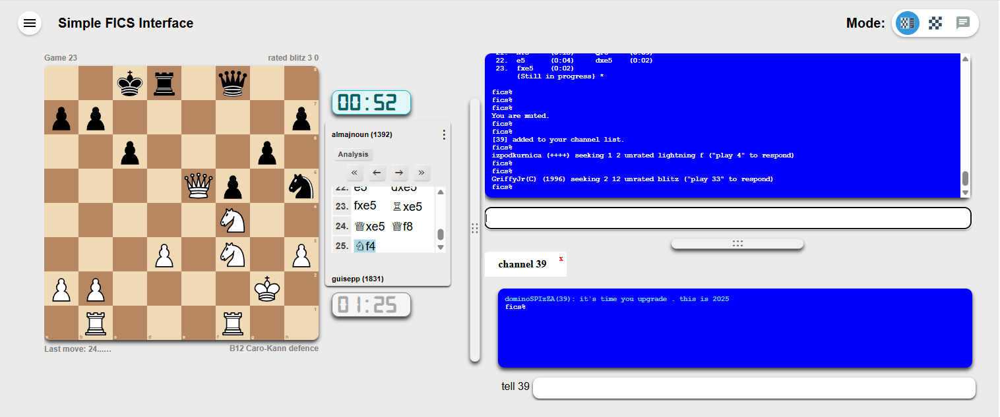
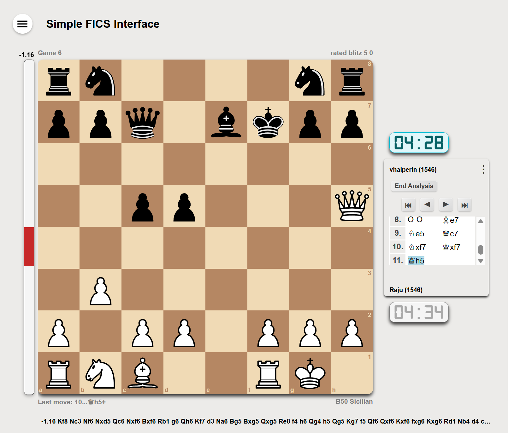

# Simple-FICS-Interface Version beta 1




Try it <a href="https://simple-fics-interface.pages.dev/" target="_blank">here</a>.

A modern, responsive chess client for the Free Internet Chess Server (FICS) built with React and TypeScript. Features a 
clean interface focused on gameplay and chat functionality with minimal UI distractions.

MIT licensed so anyone can fork and build upon it without worrying about IP.

You can use this repo to report Issues.

## Features
**Working Functionality:**

- **Multiple Chess Variants**: 
  - Standard, Chess960, Losers, Suicide, Atomic, Crazyhouse, Wild all supported
  - Full client-side move validation
  - Pre-move support with validation
- **Stockfish 16 WASM Integration** for real-time analysis
- **Modern UI Features**:
  - Smooth piece animations
  - Drag-and-drop and click-click move input
  - Premove (Right click to clear)
  - Smart scroll in chat
  - Responsive design (portrait/landscape modes). Should work on phones and tablets.
  - Landscape as well as Portrait mode. Show work with tilt on phones/tablets.
  - Dark/Light theme support
  - 30+ chess piece sets. (Same as lichess.org)
  - Drag-and-drop chat tabs
  - Chat links for player handles.
- **FICS Protocol Support**:
  - Timeseal2 protocol
  - Style12 board updates
  - Channel and private chat tabs
  - Game observation
  - Player context menus
- **Game Features**:
  - Move list with navigation
  - ECO opening database
  - Captured pieces display
  - Clock display with low-time warnings
  - Draw/Resign/Abort controls
  - Pawn promotion dialogs

## Quick Start

### Option 1: Open Directly
Simply open `index.html` in your browser. The app is pre-built and ready to use.

### Option 2: Development Server
```bash
# Install dependencies
yarn install

# Start development server
yarn web
```

Then open http://localhost:5173

## Project Structure

This is a monorepo using Yarn workspaces:

```
packages/
├── shared/     # Core business logic, chess engine, FICS protocol
├── web/        # React web application
└── mobile/     # React Native app (in development)
```

## Building

```bash
# Build the web app
yarn build:web
```

The built files are already included in `packages/web/dist/` for easy deployment.

## Deployment

The app is configured for Cloudflare Pages deployment with:
- `_headers` file for proper CORS headers (required for Stockfish)
- Pre-built assets in `packages/web/dist/`
- Root `index.html` that loads the app

## Development

### Key Technologies
- **Frontend**: React 18, TypeScript, MobX, styled-components
- **Chess Engine**: Custom implementation supporting multiple variants
- **Analysis**: Stockfish 16 WASM
- **Build Tool**: Vite
- **Testing**: Jest with ~98% coverage on core logic

### Architecture
- MobX stores for state management
- WebSocket connection to FICS servers
- Custom chess engine with full variant support
- Responsive design system

## Roadmap

**In Progress:**
- Additional UI polish and animations
- Adding Preferences
- Bug fixes

**Planned:**
- Enhanced mobile experience by creating react native apps.

**Not Planned:**
- Bughouse support
- Multiple simultaneous boards

## Contributing

This project uses Claude.ai for development assistance. See `CLAUDE.md` for AI collaboration guidelines.

## Browser Requirements

- Modern browser with WebAssembly support
- SharedArrayBuffer support (for Stockfish analysis)
- WebSocket support

## License
[MIT License](MIT.license.md)
