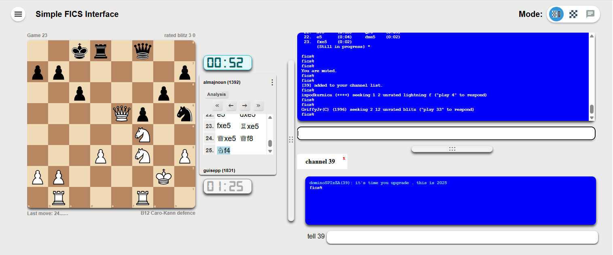
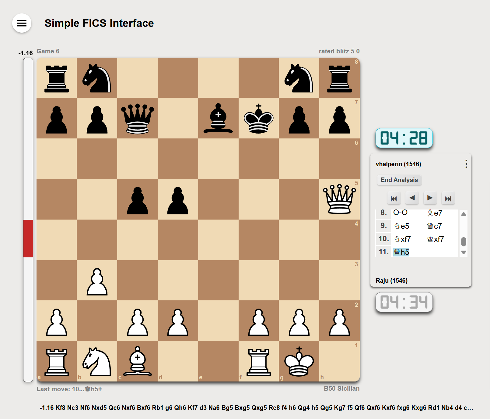

# Simple-FICS-Interface



Try it <a href="https://simple-fics-interface.pages.dev/" target="_blank">here</a>.

A minimalist FICS interface which focuses on easy game play and chat functionality with few UI distractions.

**Functionality** (Working functionality):
- Variants: Chess 960, Losers, Suicide, Atomic, Classic, Wild/*.
  - Client side validation.
  - Pre-move validation.
- Stockfish 16 WASM integration with:
- Move animations.
- Smart scroll.
- Channel tabs.
- resizable board and tab area with adjusters.
- svg chess sets
- Timeseal2.
- Drag and drop and 'click-click' move.
- ECO/Opening description lookup based on moves made.

**Road Map**

**Planned features to add:**

- Crazyhouse support.
- Preferences:
  - Expand preferences a bit (not too much).
- Responsive web design. (For phone/tablet support. Added after everything is in place)
  - More changes for Responsive web design that work on mobile and tablets. (Last after features are added.)
    - Add a layout when width is an issue that places the clocks ontop and underneath the board to reduce width.
- Regression testing.
  - Test all functionality.

**Features that are not going to be supported:**

- Bughouse support.
- Viewing multiple boards at once.

## Development Setup

### Running Locally

For basic functionality, you can open `index.html` directly in a browser. However, **for chess analysis mode to work properly**, you must run the application through a web server due to WebAssembly security restrictions.

#### Option 1: Node.js Server (Recommended)
```bash
# Install Node.js if not already installed
# Then run:
node server.js
```

The application will be available at `http://localhost:3000`

#### Option 2: Python Server
```bash
# Python 3
python -m http.server 3000

# Python 2
python -m SimpleHTTPServer 3000
```

### Analysis Mode Requirements

The chess analysis feature uses Stockfish 16 WebAssembly and requires specific HTTP headers to function properly:

#### Required Headers for Stockfish Files
The following files **must** be served with these specific headers:

**For `sf16-7.js`:**
```
Content-Type: application/javascript
Cross-Origin-Embedder-Policy: require-corp
Cross-Origin-Opener-Policy: same-origin
```

**For `sf16-7.wasm`:**
```
Content-Type: application/wasm
Cross-Origin-Embedder-Policy: require-corp
Cross-Origin-Opener-Policy: same-origin
```

#### Why These Headers Are Required
- **Cross-Origin-Embedder-Policy: require-corp**: Required for SharedArrayBuffer support in WebAssembly
- **Cross-Origin-Opener-Policy: same-origin**: Enables cross-origin isolation for enhanced security
- **Proper Content-Type**: Ensures browsers handle the files correctly

#### Troubleshooting Analysis Mode
If analysis mode doesn't work:
1. **Check browser console** for CORS or WebAssembly errors
2. **Verify server headers** using browser developer tools (Network tab)
3. **Use a proper web server** - file:// protocol won't work
4. **Check browser compatibility** - modern browsers required for WebAssembly

The included `server.js` automatically sets these headers correctly.