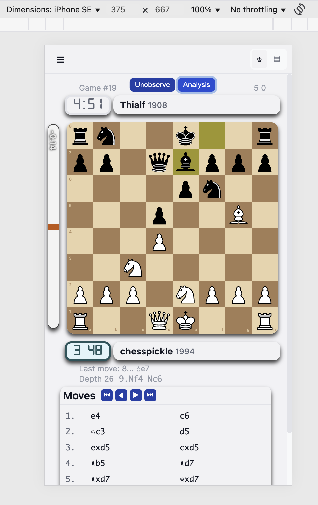

# Simple-FICS-Interface Version beta 2

A modern, responsive chess client for the Free Internet Chess Server (FICS) built with React and TypeScript. Features a clean interface focused on gameplay and chat functionality with minimal UI distractions.

Try it <a href="https://simple-fics-interface.pages.dev/" target="_blank">here</a>.

Desktop Light Mode, Landscape

Desktop Dark Mode, Portrait

Dark Mode, Portrait

Small Mobile, analysis mode.

Small Mobile, chat mode.


## Overview

MIT licensed so anyone can fork and build upon it without worrying about IP.

You can use this repo to report Issues.

## Features
**Working Functionality:**
- **Mobile support**
  - Works in tiny iPhone SE resolutions
  - Adaptive layout modes: chess-only, chat-only, or chess-and-chat based on viewport
  - Landscape and portrait orientations with device tilt support
- **Multiple Chess Variants**: 
  - Standard, Chess960, Losers, Suicide, Atomic, Wild all supported
  - Full client-side move validation
  - Crazyhouse support (experimental)
- **Stockfish 16 WASM Integration** for real-time analysis
  - Perspective is always of the bottom player
  - Top tier analysis all run in JavaScript
  - Dedicated analysis column in landscape mode (no board shifting)
  - Evaluation bar with centipawn display
- **Modern UI Features**:
  - Smooth piece animations with configurable duration
  - Auto-disable animations when low on time
  - Drag-and-drop and click-click move input
  - Premove support (right-click to clear)
  - Smart scroll in chat with auto-scroll toggle
  - Responsive design with three adaptive modes
  - Dark/Light theme support
  - 30+ chess piece sets (same as lichess.org)
  - Drag-and-drop chat tabs
  - Board coordinates toggle
  - Legal move indicators
  - Manual board flipping
- **Settings System**:
  - Comprehensive settings dialog with categories
  - Quick settings popover (magic wand)
  - Auto-promotion piece configuration
  - Sound effects (moves, captures, illegal moves)
  - Persistent local storage
- **FICS Protocol Support**:
  - Timeseal2 protocol
  - Style12 board updates
  - Channel and private chat tabs
  - Click on games, history, journal to view games
  - Click on player names for actions (finger, vars, etc.)
  - Game observation with real-time updates
  - Player context menus
  - Clear list support (clear censor, clear noplay, etc.)
  - Hover over messages to see time received
- **Game Features**:
  - Move list with navigation (keyboard arrow keys supported)
  - ECO opening database
  - Captured pieces display (clickable for Crazyhouse drops)
  - Clock display with low-time warnings
  - Draw/Resign/Abort controls
  - Pawn promotion dialog and quick promotion
  - Game examination support
  - Position setup via FEN

## Quick Start

### Option 1: Open Directly
Simply open `index.html` in your browser. The app is pre-built and ready to use.

### Option 2: Development Server
```bash
# Install dependencies
yarn install

# Start development server
yarn web         # Standard dev server (port 5173)
yarn dev         # Enhanced dev mode (port 14040)
yarn claude      # Claude-specific mode (port 14080)
```

## Connecting to FICS

1. Open the app in your browser
2. Enter your FICS username and password
3. For guest access, use username "guest"
4. Click "Connect" to join the server

The app will automatically reconnect if the connection is lost.

## Project Structure

This is a monorepo using Yarn workspaces:

```
packages/
├── shared/     # Core business logic, chess engine, FICS protocol
├── web/        # React web application
└── mobile/     # React Native app (in development)
```

## Building

```bash
# Build the web app
yarn build:web

# Run tests
yarn test

# Type checking
yarn typecheck
```

The built files are already included in `packages/web/dist/` for easy deployment.

## Deployment

The app is configured for Cloudflare Pages deployment with:
- `_headers` file for proper CORS headers (required for Stockfish)
- Pre-built assets in `packages/web/dist/`
- Root `index.html` that loads the app

## Development

### Key Technologies
- **Frontend**: React 18, TypeScript, MobX, styled-components
- **Chess Engine**: Custom implementation supporting multiple variants
- **Analysis**: Stockfish 16 WASM
- **Build Tool**: Vite
- **Testing**: Jest with ~98% coverage on core logic

### Architecture
- MobX stores for state management
- WebSocket connection to FICS servers
- Custom chess engine with full variant support
- Responsive design system

## Keyboard Shortcuts

- **Arrow Keys**: Navigate through moves
- **Right Click**: Clear premove
- **Escape**: Cancel piece selection

## Common FICS Commands

```
tell <user> <message>     # Send private message
<channel>. <message>      # Send channel message
observe <game>           # Watch a game
seek <time> <inc>        # Seek a game
examine                  # Examine your last game
flip                     # Flip the board
```

## Roadmap

**In Progress:**
- Fix some annoying chat issues
- Improve Crazyhouse stability

** Possible enhancments **
- Add IOS/Android app and complete mobile support. (Currently works via browser)

**Not Planned:**
- Bughouse support
- Multiple simultaneous boards
- Tournament management

## Contributing

This project uses Claude.ai for development assistance. See `CLAUDE.md` for AI collaboration guidelines.

## Browser Requirements

- Modern browser with WebAssembly support
- SharedArrayBuffer support (for Stockfish analysis)
- WebSocket support

## License
[MIT License](MIT.license.md)
