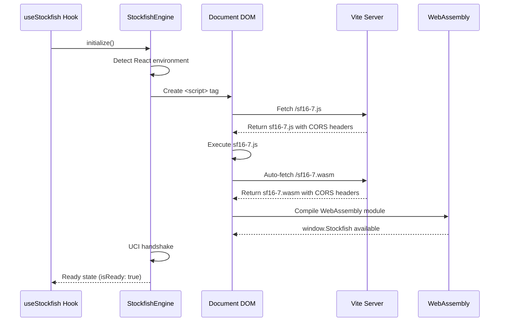

# Stockfish WebAssembly Integration in React

This document describes how Stockfish chess engine WebAssembly files are integrated into the React web application using
the public assets approach.

## Overview

The Simple FICS Interface uses Stockfish 16.7 chess engine compiled to WebAssembly for position analysis. The
integration supports both development and production environments with automatic loading, proper CORS headers, and
TypeScript support.

## Architecture

### File Structure

```
packages/
├── shared/src/services/
│   └── StockfishEngine.ts          # Engine wrapper with React support
├── web/
│   ├── public/                     # Static assets served by Vite
│   │   ├── sf16-7.js              # Stockfish JavaScript wrapper
│   │   └── sf16-7.wasm            # Stockfish WebAssembly binary
│   ├── src/hooks/
│   │   └── useStockfish.ts        # React hook for engine integration
│   ├── vite.config.ts             # CORS headers configuration
│   └── DEPLOYMENT.md              # Production deployment guide
```

### Loading Strategy

The integration uses a **public assets approach** where WebAssembly files are:

1. Placed in the React `public/` directory
2. Dynamically loaded via JavaScript when needed
3. Served with required CORS headers for SharedArrayBuffer support

## Implementation Details

### 1. StockfishEngine.ts Enhancement

The shared `StockfishEngine` class automatically detects React environments and loads files appropriately:

```typescript
class StockfishEngine {
    private isReactEnvironment: boolean;

    constructor() {
        // Detect React/browser environment
        this.isReactEnvironment = typeof window !== 'undefined' &&
            typeof document !== 'undefined';
    }

    async initialize(): Promise<boolean> {
        // React environment - load from public directory
        if (this.isReactEnvironment) {
            if (typeof window.Stockfish !== 'function') {
                await this.loadStockfishScript('/sf16-7.js');
            }
        }
        // ... rest of initialization
    }

    private loadStockfishScript(src: string): Promise<void> {
        return new Promise((resolve, reject) => {
            const script = document.createElement('script');
            script.src = src;
            script.async = true;
            script.onload = () => resolve();
            script.onerror = () => reject();
            document.head.appendChild(script);
        });
    }
}
```

### 2. React Hook Integration

The `useStockfish` hook provides a clean React interface:

```typescript
export const useStockfish = (options: StockfishHookOptions = {}): StockfishHookReturn => {
    const [engine, setEngine] = useState<StockfishEngine | null>(null);
    const [isLoading, setIsLoading] = useState(true);
    const [isReady, setIsReady] = useState(false);
    const [error, setError] = useState<string | null>(null);

    const initialize = useCallback(async (): Promise<boolean> => {
        const stockfish = new StockfishEngine();
        const success = await stockfish.initialize();

        if (success) {
            setEngine(stockfish);
            setIsReady(true);
        }

        return success;
    }, []);

    // Auto-initialize if requested
    useEffect(() => {
        if (options.autoInitialize && !engine) {
            initialize();
        }
    }, []);

    return {engine, isLoading, isReady, error, initialize, analyzePosition, stopAnalysis};
};
```

### 3. CORS Headers Configuration

Vite development server is configured with required headers:

```typescript
// vite.config.ts
export default defineConfig({
    server: {
        headers: {
            'Cross-Origin-Embedder-Policy': 'require-corp',
            'Cross-Origin-Opener-Policy': 'same-origin',
        }
    },
    preview: {
        headers: {
            'Cross-Origin-Embedder-Policy': 'require-corp',
            'Cross-Origin-Opener-Policy': 'same-origin',
        }
    }
});
```

## Loading Flow

### Complete Loading Sequence



### Detailed Timeline

| Time    | Event            | Description                               |
|---------|------------------|-------------------------------------------|
| T+0ms   | Hook Called      | `useStockfish({ autoInitialize: true })`  |
| T+10ms  | Initialize       | `StockfishEngine.initialize()` starts     |
| T+20ms  | Script Injection | `<script src="/sf16-7.js">` added to DOM  |
| T+50ms  | JS Fetch         | Browser requests `/sf16-7.js` from Vite   |
| T+200ms | JS Execution     | `sf16-7.js` runs, auto-fetches WASM       |
| T+300ms | WASM Fetch       | Browser requests `/sf16-7.wasm`           |
| T+500ms | WASM Compile     | WebAssembly module compilation            |
| T+600ms | Global Ready     | `window.Stockfish()` function available   |
| T+700ms | UCI Handshake    | Engine initialization and UCI setup       |
| T+800ms | Hook Ready       | `isReady: true`, engine available for use |

## Usage Examples

### Basic Integration

```tsx
import React from 'react';
import {useStockfish} from '../hooks/useStockfish';

const ChessAnalysis: React.FC = () => {
    const {engine, isLoading, isReady, error, analyzePosition, stopAnalysis} = useStockfish({
        autoInitialize: true,
        onAnalysis: (result) => {
            if (result.type === 'bestmove') {
                console.log('Best move:', result.move);
            } else if (result.type === 'info') {
                console.log('Analysis:', result.line);
            }
        }
    });

    const handleAnalyze = () => {
        if (isReady) {
            analyzePosition('rnbqkbnr/pppppppp/8/8/8/8/PPPPPPPP/RNBQKBNR w KQkq - 0 1');
        }
    };

    if (isLoading) return <div>Loading Stockfish...</div>;
    if (error) return <div>Error: {error}</div>;

    return (
        <div>
            <button onClick={handleAnalyze} disabled={!isReady}>
                Analyze Position
            </button>
            <button onClick={stopAnalysis} disabled={!isReady}>
                Stop Analysis
            </button>
        </div>
    );
};
```

### Manual Initialization

```tsx
const ChessComponent: React.FC = () => {
    const {initialize, isReady} = useStockfish({autoInitialize: false});

    const handleStartAnalysis = async () => {
        const success = await initialize();
        if (success) {
            console.log('Stockfish is ready for analysis');
        } else {
            console.error('Failed to initialize Stockfish');
        }
    };

    return (
        <button onClick={handleStartAnalysis}>
            {isReady ? 'Engine Ready' : 'Initialize Engine'}
        </button>
    );
};
```

### Advanced Analysis with Callbacks

```tsx
const AdvancedAnalysis: React.FC = () => {
    const [evaluation, setEvaluation] = useState<number | null>(null);
    const [bestMove, setBestMove] = useState<string | null>(null);
    const [depth, setDepth] = useState<number>(0);

    const {analyzePosition, setAnalysisCallback, isReady} = useStockfish({
        autoInitialize: true
    });

    useEffect(() => {
        setAnalysisCallback((result) => {
            if (result.type === 'info') {
                // Parse Stockfish info output
                const line = result.line;

                // Extract evaluation score
                const scoreMatch = line.match(/score cp (-?\d+)/);
                if (scoreMatch) {
                    setEvaluation(parseInt(scoreMatch[1]) / 100); // Convert centipawns to pawns
                }

                // Extract search depth
                const depthMatch = line.match(/depth (\d+)/);
                if (depthMatch) {
                    setDepth(parseInt(depthMatch[1]));
                }
            } else if (result.type === 'bestmove') {
                setBestMove(result.move || null);
            }
        });
    }, [setAnalysisCallback]);

    return (
        <div>
            <button
                onClick={() => analyzePosition('r1bqkbnr/pppp1ppp/2n5/4p3/4P3/5N2/PPPP1PPP/RNBQKB1R w KQkq - 4 4')}
                disabled={!isReady}
            >
                Analyze Italian Game Position
            </button>

            {evaluation !== null && (
                <div>Evaluation: {evaluation > 0 ? '+' : ''}{evaluation.toFixed(2)}</div>
            )}
            {depth > 0 && <div>Depth: {depth}</div>}
            {bestMove && <div>Best Move: {bestMove}</div>}
        </div>
    );
};
```

## Browser Compatibility

### Supported Browsers

The WebAssembly integration requires modern browsers with SharedArrayBuffer support:

- **Chrome**: 68+ (recommended: 88+)
- **Firefox**: 79+ (recommended: 89+)
- **Safari**: 15.2+ (recommended: 16+)
- **Edge**: 79+ (recommended: 88+)

### Feature Detection

```typescript
const checkStockfishSupport = (): boolean => {
    // Check for WebAssembly support
    if (typeof WebAssembly !== 'object') {
        return false;
    }

    // Check for SharedArrayBuffer (required for multi-threading)
    if (typeof SharedArrayBuffer === 'undefined') {
        console.warn('SharedArrayBuffer not available - falling back to single-threaded mode');
        return true; // Still supported, but slower
    }

    return true;
};
```

## Development Setup

### Prerequisites

1. **Node.js**: 18+ required
2. **Yarn**: Package manager
3. **Modern Browser**: Chrome 88+ recommended for development

### Running Development Server

```bash
# Install dependencies
yarn install

# Start development server with CORS headers
cd packages/web
yarn start

# Server runs on http://localhost:5173 with proper headers
```

### Testing Stockfish Integration

The app includes a built-in test component accessible in the main interface:

1. Start the development server
2. Open browser to `http://localhost:5173`
3. Look for "Stockfish Integration Test" section
4. Test engine initialization and analysis

### Development Debugging

Enable detailed logging:

```typescript
// In StockfishEngine.ts, enable debug mode
const DEBUG_STOCKFISH = true;

if (DEBUG_STOCKFISH) {
    console.log('Stockfish loading from:', src);
    console.log('Engine ready:', this.isReady);
    console.log('Available globals:', Object.keys(window).filter(k => k.includes('stock')));
}
```

## Production Deployment

### Build Process

```bash
# Build for production
cd packages/web
yarn build

# Files are output to dist/ directory
# sf16-7.js and sf16-7.wasm are copied to dist/ root
```

### Server Configuration

Production servers must serve the required CORS headers. See `packages/web/DEPLOYMENT.md` for platform-specific
configurations:

- **Apache**: `.htaccess` configuration
- **Nginx**: Server block configuration
- **Cloudflare**: Workers/Pages configuration
- **Netlify**: `_headers` file
- **Vercel**: `vercel.json` configuration

### CDN Considerations

When using CDNs, ensure:

1. **Same Origin**: WASM files served from same domain
2. **CORS Headers**: Applied at CDN level
3. **Caching**: Appropriate cache headers for WASM files
4. **Compression**: Gzip/Brotli compression enabled

## Performance Optimization

### Loading Performance

1. **Lazy Loading**: Engine loads only when analysis is needed
2. **Caching**: Browser caches WASM binary across sessions
3. **Compression**: Vite applies optimal compression
4. **Preloading**: Optional preload hints for faster initialization

```typescript
// Optional: Preload hints in HTML head
<link rel = "preload"
href = "/sf16-7.wasm" as = "fetch"
type = "application/wasm"
crossorigin >
```

### Runtime Performance

1. **Web Workers**: Run analysis in separate thread (optional enhancement)
2. **Analysis Depth**: Configurable depth limits for faster responses
3. **Position Caching**: Cache analysis results for repeated positions
4. **UCI Commands**: Efficient command batching

## Troubleshooting

### Common Issues

#### 1. CORS Headers Missing

**Symptoms**: Console errors about SharedArrayBuffer, slow performance
**Solution**: Verify CORS headers in Network tab, check server configuration

#### 2. WASM Loading Fails

**Symptoms**: "Failed to load Stockfish script" error
**Solution**: Verify files exist in public/ directory, check browser compatibility

#### 3. Engine Timeout

**Symptoms**: Initialization hangs, timeout errors
**Solution**: Check browser console for detailed errors, verify network connection

#### 4. Analysis Not Working

**Symptoms**: No analysis output, UCI commands fail
**Solution**: Verify engine is ready (`isReady: true`), check callback setup

### Debug Checklist

1. ✅ Files exist in `packages/web/public/`
2. ✅ CORS headers present in Network tab
3. ✅ Browser supports WebAssembly + SharedArrayBuffer
4. ✅ No console errors during loading
5. ✅ `window.Stockfish` function available
6. ✅ Engine initialization completes without timeout

## API Reference

### useStockfish Hook

```typescript
interface StockfishHookOptions {
    autoInitialize?: boolean;        // Auto-start engine (default: true)
    onAnalysis?: AnalysisCallback;   // Analysis result callback
}

interface StockfishHookReturn {
    engine: StockfishEngine | null;  // Engine instance
    isLoading: boolean;              // Loading state
    isReady: boolean;                // Ready for analysis
    error: string | null;            // Error state
    initialize: () => Promise<boolean>;          // Manual initialization
    analyzePosition: (fen: string) => void;     // Start position analysis
    stopAnalysis: () => void;                   // Stop current analysis
    setAnalysisCallback: (cb: AnalysisCallback) => void; // Update callback
}
```

### StockfishEngine Class

```typescript
class StockfishEngine {
    // Core methods
    initialize(): Promise<boolean>;

    isEngineReady(): boolean;

    analyzePosition(fen: string, options?: AnalysisOptions): void;

    stopAnalysis(): void;

    setAnalysisCallback(callback: AnalysisCallback): void;

    // UCI communication
    private handleMessage(line: string): void;

    private startUCIHandshake(): void;
}
```

### Type Definitions

```typescript
interface AnalysisResult {
    type: 'info' | 'bestmove';
    line: string;
    move?: string;
}

interface AnalysisOptions {
    depth?: number;    // Search depth limit
    time?: number;     // Time limit (ms)
    nodes?: number;    // Node limit
}

type AnalysisCallback = (result: AnalysisResult) => void;
```

## Future Enhancements

### Planned Features

1. **Web Worker Integration**: Move engine to worker thread for better performance
2. **Multi-Engine Support**: Support for different Stockfish variants
3. **Position Evaluation Cache**: Cache analysis results for better UX
4. **Analysis Presets**: Predefined depth/time configurations
5. **Tournament Mode**: Optimized settings for competitive play

### Contribution Guidelines

When contributing to Stockfish integration:

1. **Maintain Compatibility**: Support both React and vanilla JS environments
2. **Add Tests**: Include test cases for new features
3. **Update Documentation**: Keep this file current with changes
4. **Performance**: Consider impact on loading times and runtime performance
5. **Browser Support**: Test across supported browser versions

---

## Additional Resources

- [Stockfish Official Website](https://stockfishchess.org/)
- [WebAssembly Documentation](https://webassembly.org/)
- [Vite Configuration Guide](https://vitejs.dev/config/)
- [SharedArrayBuffer on MDN](https://developer.mozilla.org/en-US/docs/Web/JavaScript/Reference/Global_Objects/SharedArrayBuffer)
- [Chess Programming Wiki](https://www.chessprogramming.org/)

*Last updated: 2024-06-29*
*Version: 1.0.0*